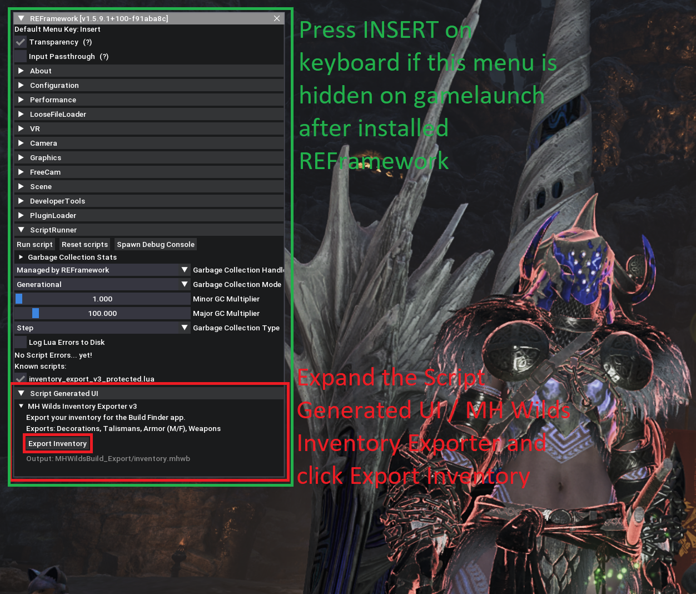

# MH Wilds Inventory Exporter

Export your armour, decorations, and talismans from **Monster Hunter Wilds** for use with the [Monster Hunter Armory](https://monster-hunter-armory.vercel.app/) build optimizer.

## Important - Please Read!

**Performance Warning:** The export script iterates through **each and every charm** in your inventory. Users with 3000+ charms will most likely experience the game freezing temporarily (showing "Game Not Responding") while the script runs. On my system it takes up to 10 seconds to complete. This is normal - please be patient and wait for it to finish. If it doesn't work on the first try, give it a few more attempts - users have reported it works after retrying.

If you experience any issues with the script, please join my Discord for support: https://discord.com/invite/R4J7EWjEM4

## Requirements

- Monster Hunter Wilds (PC/Steam)
- [REFramework](https://www.nexusmods.com/monsterhunterwilds/mods/93)

## Installation

### Step 1: Install REFramework

1. Download REFramework from [Nexus Mods](https://www.nexusmods.com/monsterhunterwilds/mods/93)
2. Extract `dinput8.dll` into your game folder:
   ```
   Steam\steamapps\common\MonsterHunterWilds
   ```

### Step 2: Install the Export Script

1. Download `inventory_export_v4_protected.lua` from the [Releases Page](https://github.com/Az3rate/Monster-Hunter-Armory-Public/releases/tag/v4.0.0)
2. Place it in the REFramework autorun folder:
   ```
   MonsterHunterWilds\reframework\autorun
   ```
   > Create the `autorun` folder if it doesn't exist

## Usage

1. Launch Monster Hunter Wilds
2. Load into any save file
3. Press `Insert` to open REFramework menu
4. Navigate to **Script Generated UI** → **MH Wilds Inventory Exporter v4**
5. Click **Export Inventory**



### Export Files

Your data will be saved to:
```
MonsterHunterWilds\reframework\data\MHWildsBuild_Export
```

Files created:
- `inventory.mhwb` - Your encrypted inventory data (armour, decorations, and talismans)

## Import to Monster Hunter Armory

1. Open the [Monster Hunter Armory](https://monster-hunter-armory.vercel.app/) app
2. Login with Discord
3. Support the development to become a Supporter
4. Click **Select Export Folder**
5. Navigate to `MHWildsBuild_Export` folder
6. Your armour, decorations, and talismans will be imported automatically


## Troubleshooting

### Script not appearing in REFramework
- Ensure the file is named exactly `inventory_export_v4_protected.lua`
- Check that it's in the correct folder: `reframework\autorun`
- Restart the game after adding the script

### Export fails or no files created
- Make sure you're loaded into a save file (not title screen)
- Check the `reframework\data` folder for error logs

## Privacy & Safety

This script:
- Only reads your inventory data (armour, decorations, talismans)
- Does not modify any game files
- Does not send data anywhere - all exports are local files
- Is safe to use online

## What's New in v4

- **Equipped decorations are now exported** - Previously, decorations slotted into your gear were not counted. Now the export includes all decorations, whether in your inventory or equipped on armour/weapons.

## Version

Current version: **4.0.0**

## License

This script is provided for personal use only. You may download and run the script, but you may not modify, decompile, reverse engineer, or attempt to decrypt it.
